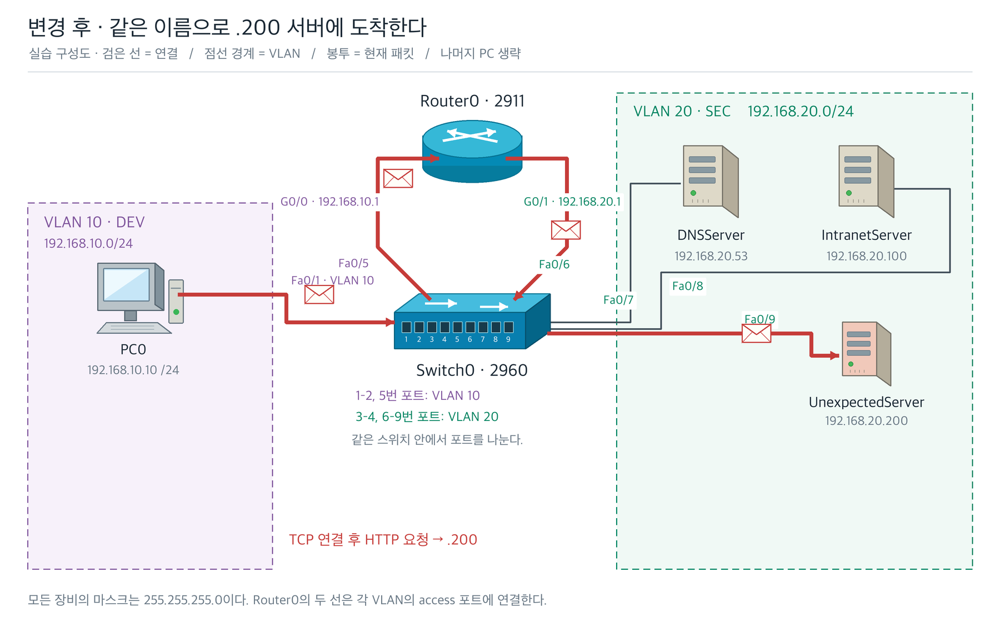

# 교안 제작 도구 모음

비전공자가 따라갈 수 있는 한국어 교안을 만들고, 설명 순서·과제·예제 출력·그림을 검수하는 도구다. 스킬의 작성 원칙과 실제 실행하는 검사기, 네트워크 그림 생성 코드를 함께 담았다.

## 들어 있는 것

| 구성 | 하는 일 |
| --- | --- |
| [교안 작성 스킬](.agents/skills/lesson-page/SKILL.md) | 상황 → 역할 → 용어 → 동작 → 확인 결과의 흐름으로 교안을 작성하도록 안내 |
| `tools/lesson_schema.py` | 교안 구조, 과제·정답, 예시 출력 표시 등을 검사 |
| `tools/lesson_render.py` | 구조화한 교안 JSON을 노션용 Markdown으로 변환 |
| `tools/lesson_harness.py` | Python 출력·용어 순서·필수 본문의 보충 의존을 검사하고 구조 REVIEW를 출력 |
| `tools/lesson_structure.py` | 목차 대응·동일 설명 반복·보충 위치를 검토하고 보충을 닫은 본문의 용어를 검사 |
| `tools/lesson_term_flow.py` | 본문·표·명령·버튼·그림·과제에서 설명보다 먼저 사용한 등록 용어를 검사 |
| `tools/lesson_lint.py` | 문체·깨진 서식·금지 표기·저장 변형 등을 검사 |
| [읽기 검수 기준](tools/judge_checklist.md) | 설명의 쉬움, 선수 지식, 학습 흐름과 시각 자료의 적합성을 검토 |
| `tools/build_network_diagrams.py` | PC·스위치·라우터·서버·케이블·패킷을 그려 SVG와 PNG 생성 |
| `tools/render_lesson_preview.py` | 교안을 브라우저에서 볼 수 있는 HTML로 변환 |
| [DNS 교안 예제](examples/day3/README.md) | 교시 6개, 용어 검사 항목 170개, 그림 19종의 사용 예 |

이미지 생성 도구는 이 저장소에 **실제 코드로 포함되어 있다**. 외부 AI 이미지 API나 노션 로그인 없이 그림을 만들 수 있다. 현재 완성 예제는 DNS 수업의 장비·주소·배치를 사용한다. 다른 주제의 그림은 장비 도형과 배치 코드를 수정해 만든다. 문장을 입력하면 모든 주제의 그림을 자동으로 만드는 도구는 아니다.



## 먼저 실행해 보기

Python 3.10 이상을 권장한다. 교안 구조·문체·용어 검사에는 별도 Python 패키지가 필요 없다. 그림을 새로 만들 때만 Pillow와 한글 글꼴이 필요하다.

저장소를 내려받고 그 폴더에서 실행한다.

```bash
python -m venv .venv
# macOS / Linux
source .venv/bin/activate
# Windows PowerShell에서는 .venv\Scripts\Activate.ps1
python -m pip install -r requirements.txt
python tools/check_examples.py
python -m unittest discover -s tools/tests -v
```

`check_examples.py`는 교시 예제 6개를 검사하고 `build/day3/`에 Markdown과 HTML 미리보기를 만든다. `build/day3/lesson1.html`을 브라우저로 열면 그림과 정답 토글을 함께 볼 수 있다. 파일을 내려받기만 해도 [완성 PNG](examples/day3/assets/)와 수정 가능한 SVG를 확인할 수 있다.

일부 예제에는 Python 코드량·에러 시연 횟수 WARN이 나온다. 이 도구가 처음에는 코딩 실강용으로 만들어졌기 때문이다. DNS 개념·관찰 교시에서는 코드 블록 수만으로 분량을 판정하지 않고 [검수 기록](docs/validation.md)에 이유를 남겼다. ERROR와 하네스 FAIL은 해결해야 한다.

## 새 교안 만들기

이 저장소 전체를 작업 공간으로 열고 [스킬](.agents/skills/lesson-page/SKILL.md)을 사용한다. 스킬을 다른 위치에 복사할 때도 `tools/`와 참고 문서가 필요하다. 사용 중인 AI 도구가 스킬을 자동으로 찾지 못하면 해당 `SKILL.md`를 읽고 따르도록 지정한다.

1. 독자의 배경지식, 목표, 수업 시간과 사용할 실습 도구를 정한다.
2. 예제 JSON을 복사해 상황·정의·그림·과제·정답을 작성한다.
3. `learning_terms`에 핵심 용어의 실제 소개 문장과 별칭을 기록한다. 그림에는 실제 레이블을 추출한 `text_content`를 넣는다.
4. 스키마 → 하네스 → 린터 → 읽기 검수 순서로 확인한다.

절마다 중심 질문을 하나로 잡고 필요한 이유·개념·예제·인접 해설·실습을 잇는다. 예외나 추가 비교는 기본 설명 뒤의 `supplement` 요소에 넣으면 접을 수 있는 보충으로 표시된다. 보충을 닫아도 필수 본문을 이해할 수 있어야 한다. 하네스의 `REVIEW`는 목차·반복 설명·보충 위치의 검토 지점이며, 의미상 중복이나 갑작스러운 주제 전환은 읽기 검수에서 판단한다.

```bash
python tools/lesson_render.py my_lesson.json my_lesson.md
python tools/lesson_harness.py my_lesson.json
python tools/lesson_lint.py my_lesson.md
python tools/render_lesson_preview.py my_lesson.md my_lesson.html --title "교안 미리보기"
```

JSON의 필드 설명은 [스키마 파일](tools/lesson_schema.py) 상단에 있다. `my_lesson.json`은 사용자가 준비할 파일 이름이다. 이미지 경로는 Markdown·HTML 파일을 놓을 위치에서 접근할 수 있게 맞춘다.

하네스는 교안 속 Python 코드를 실제로 실행한다. 신뢰할 수 있는 예제에 사용한다. 용어 검사는 **등록된 목록**의 사용 순서를 확인한다. 새 용어의 누락, 정의가 정말 쉬운지, 같은 문단 안의 설명 순서, 실습의 실제 성공까지 자동으로 보증하지는 않는다. 이 부분은 읽기 검수와 해당 실습 환경에서 확인한다.

## 그림 다시 만들기

```bash
python tools/build_network_diagrams.py --out build/diagrams
```

사용 가능한 한글 글꼴이 없으면 직접 지정한다. 글꼴 파일은 포함하지 않았다.

```bash
python tools/build_network_diagrams.py --out build/diagrams --font "/path/to/NotoSansCJK-Regular.ttc"
```

옵션과 배치 수정 방법은 [그림 도구 안내](docs/diagrams.md)를 참고한다. 글꼴이 달라지면 글자 폭도 달라지므로 결과를 눈으로 확인한다.

## 노션에 반영하기

이 저장소는 **작성·검수·그림 생성** 도구다. 노션 인증 정보나 자동 발행 연결은 포함하지 않는다. 자신의 노션 연결을 갖춘 AI 도구에서 스킬의 발행 절차를 따른다. 샘플 이미지 경로 `assets/...png`는 로컬 미리보기용이므로 노션에는 이미지를 업로드하고 해당 이미지 참조로 바꿔야 한다.

기존 페이지는 실제 내용을 먼저 읽고 필요한 부분만 수정한다. `tools/mkedit.py`는 부분 수정 내용을 검사해 전송용 JSON을 만드는 보조 도구이며, 그 자체로 페이지를 발행하지 않는다. 발행 후에는 저장된 본문을 다시 받아 린터와 원문 비교로 확인한다.

## 공유 방식

현재는 비공개 저장소로 운영한다. 함께 사용할 사람을 저장소의 **Settings → Collaborators**에서 초대하면 된다. 초대는 소유자가 대상자를 정해 진행한다. [GitHub의 저장소 협업 안내](https://docs.github.com/en/repositories/creating-and-managing-repositories/access-to-repositories)

별도의 공개 배포 라이선스는 아직 지정하지 않았다. 외부에 공개하거나 재배포 조건을 정할 때는 코드·스킬·교안 예제·이미지의 허용 범위를 함께 정한다.
